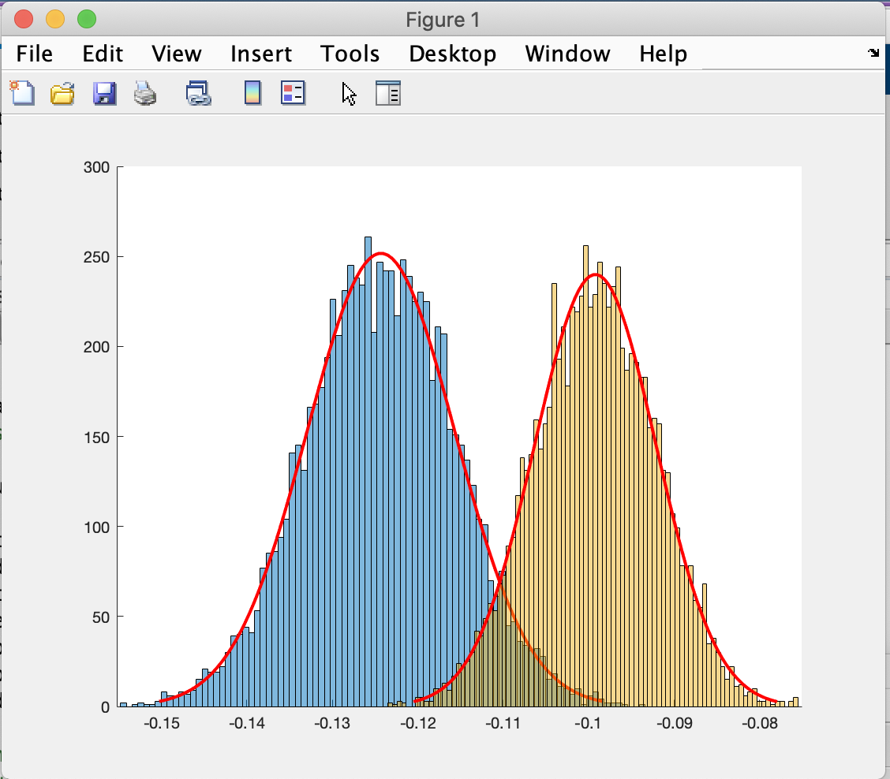
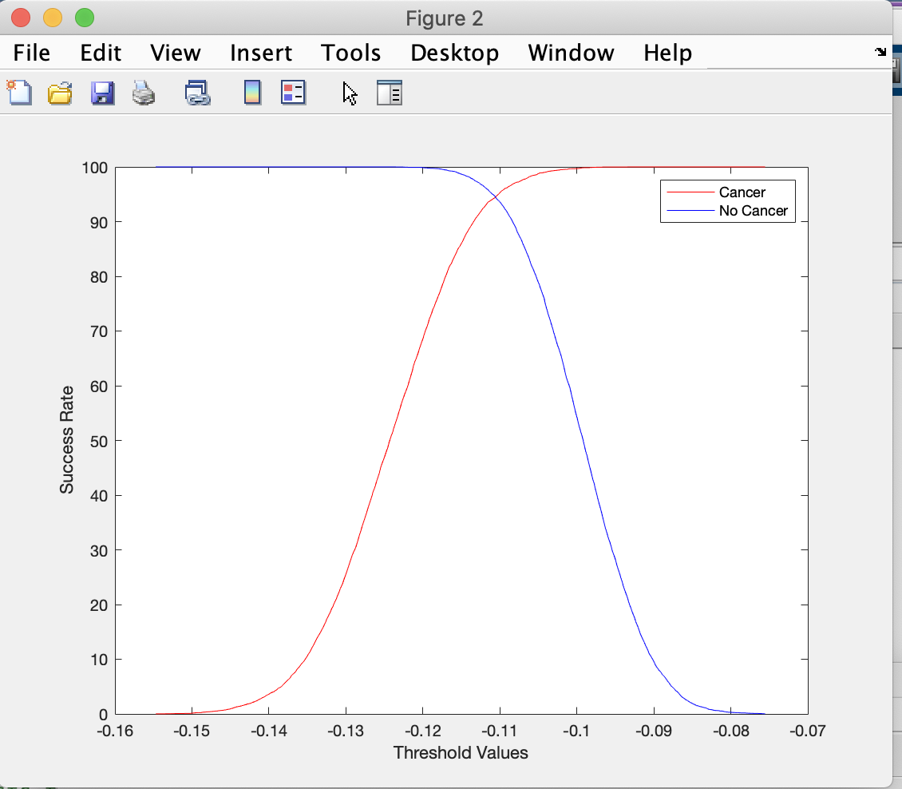
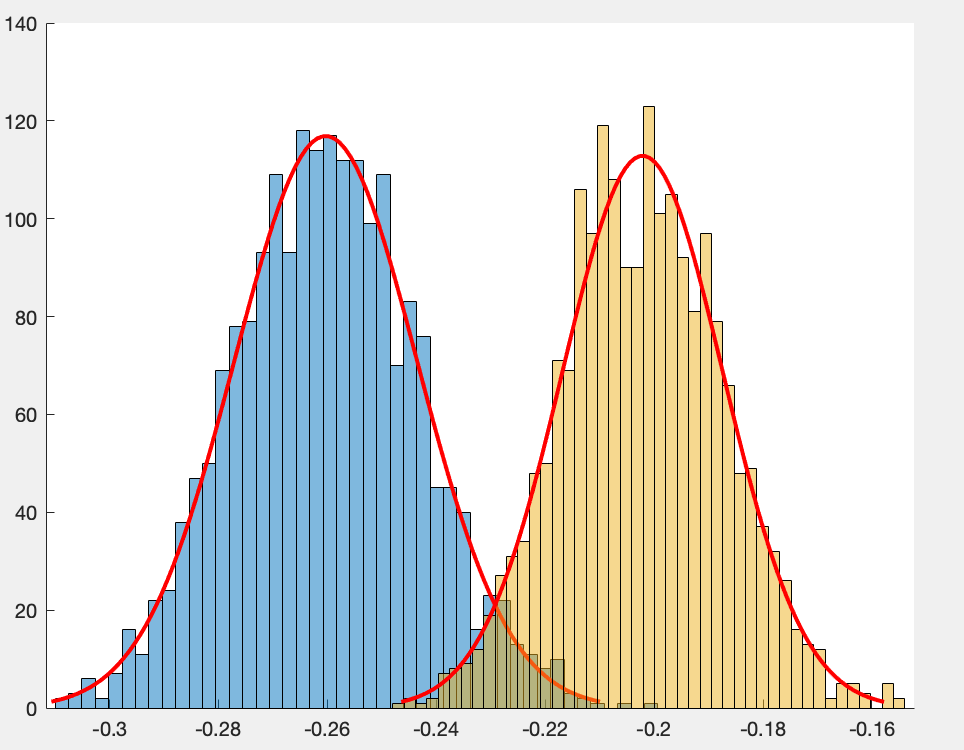
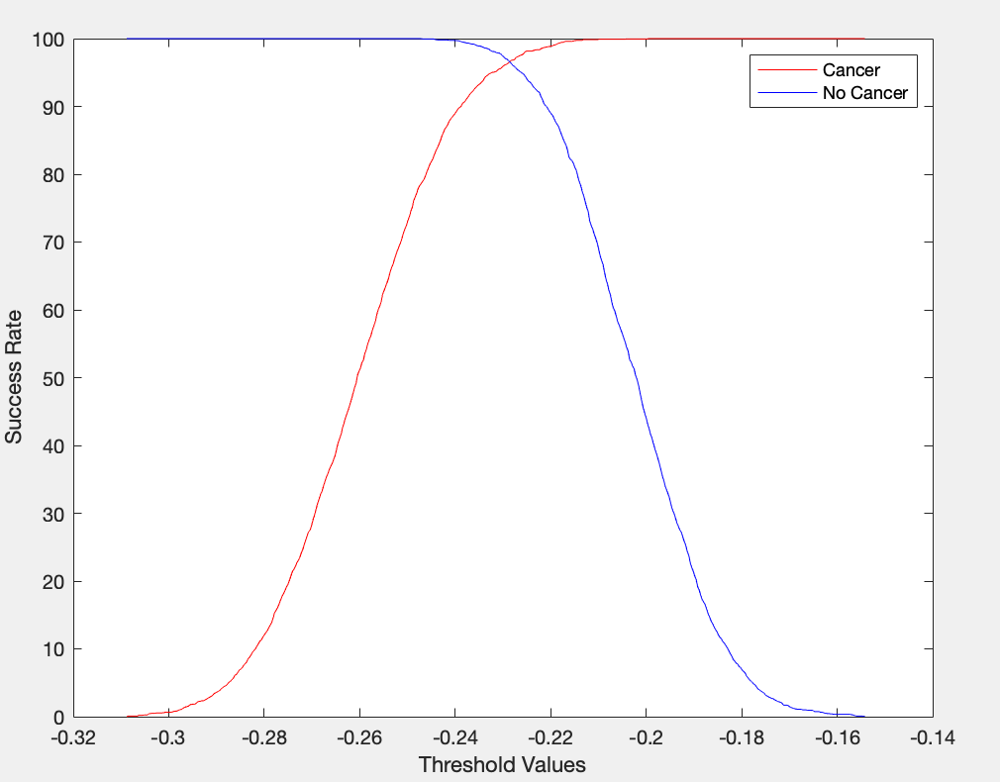

# Cancer-Testing
This program helps pre-screen patients for risk of ovarian cancer. This is accomplished by utilizing linear discriminant analysis to build a linear classifier that can distinguish between data points of those belonging to patients with and without cancer. We utilize the data set spectra.mat, which contains the spectra count of different patients. The data is split into training and testing data, with the first 8000 samples being training and the last as testing. 

### Requirements
* The data set spectra.mat
* MatLab

### Implementation
Open `cancer_testing.m` in MatLab and run. 

### Output
We were able to find a relatively high success rate in setting a threshold with our training data. The Matlab program also outputs 4 figures, the histogram and ROC curve for both the training and testing data. The histogram visualizes the projection of our original data set onto one-dimensional linear space. The ROC curve visualizes the percentage of accuracy for all possible values using the threshold we set.

Histogram for Training Data

ROC Curve for Training Data

Histogram for Testing Data

ROC Curve for Testing Data

